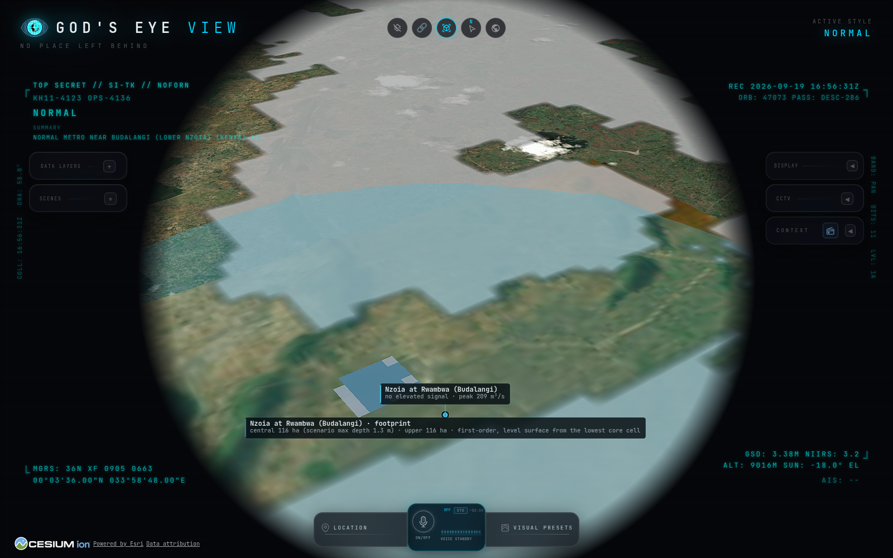

# Kenya · El Niño 2026 fork

This fork of [God's Eye View](https://github.com/bilawalsidhu/gods-eye-view)
adds a Kenya flood-watch layer group for the October to December 2026 rains.
Everything in it is public data fetched live from the browser or bundled with
its licence noted in `DATA_SOURCES.md`. No API key is needed for any of it.

## Run it

```bash
npm ci
npm run dev
```

Open the printed localhost URL. In the **DATA LAYERS** panel there is a new
group, **Kenya · El Niño 2026**, with five toggles:

| Toggle                 | What it shows                                                                                                                                                                                                                                                                                                                                                                                                                                        | Where the data comes from                                                                                        | Refresh                                        |
| ---------------------- | ---------------------------------------------------------------------------------------------------------------------------------------------------------------------------------------------------------------------------------------------------------------------------------------------------------------------------------------------------------------------------------------------------------------------------------------------------- | ---------------------------------------------------------------------------------------------------------------- | ---------------------------------------------- |
| KMD Warnings           | The Kenya Meteorological Department's official CAP warnings drawn as their warning polygons (solid while in force, faded for 30 days after expiry) with the headline, severity, dates and instruction. This sits above every model score on purpose.                                                                                                                                                                                                 | KMD CAP 1.2 feed (WMO-registered alerting authority), via a same-origin extract                                  | extract refreshed hourly by the Pages workflow |
| River Sites (GloFAS)   | 24 modelled river sites (Nzoia at Budalangi, Nyando at Ahero, Tana at Garissa, Nairobi River at Kariobangi, and so on) as ground discs coloured by **modelled flood potential**: the share of the GloFAS ensemble (50 perturbed members) that crosses this cell's own 1.5-, 2-, 5- and 20-year return levels within 10 days. Click one for the numbers.                                                                                              | GloFAS v4 (Copernicus) via the Open-Meteo Flood API; thresholds bundled from the reanalysis                      | hourly (the model itself updates daily)        |
| Flood Footprints (3D)  | Where the forecast water can physically sit: for every river site the browser samples the terrain mesh into a 31×31 grid (±3 km, ~200 m cells), finds the channel, lifts a water surface by the stage the forecast discharge implies and floods the connected low ground. Central ensemble peak solid, upper peak faint, drawn as water columns from ground to surface so an oblique camera shows depth. First order: no roughness, dykes or timing. | Re:Earth terrain mesh (keyless) × GloFAS ensemble × Andreadis et al. 2013 hydraulic geometry, all in the browser | hourly, with the river sites                   |
| County Rainfall (7d)   | All 47 counties painted by their 7-day rainfall forecast total, with a card per county, the 2019 census residents, and a click readout of the daily millimetres. Missing days are shown as missing, never as dry.                                                                                                                                                                                                                                    | Open-Meteo forecast API at each county centroid; KNBS 2019 census                                                | hourly                                         |
| Satellite Rainfall     | GPM IMERG rainfall-rate picture draped on the globe, half-hourly slots, about four hours behind real time. Needs a globe basemap: switch off Google 3D (Esri or OSM) to see it.                                                                                                                                                                                                                                                                      | NASA GIBS, GPM IMERG Early run                                                                                   | hourly                                         |
| Flood Water (observed) | Water the satellites actually saw: the NASA MODIS/VIIRS near-real-time Global Flood Product (250–375 m, 1- to 3-day composites). Cyan is usual surface water, red is flood water, yellow is recurring flood, grey is no clear view (cloud or shadow). The panel line says which day's composite was asked for.                                                                                                                                       | NASA GIBS, MODIS/VIIRS NRT Global Flood Product                                                                  | hourly (daily product)                         |
| GDACS Flood Alerts     | Flood events in Kenya, Uganda, Tanzania, Ethiopia, Somalia, South Sudan, Rwanda and Burundi from the last 90 days, as pins coloured by GDACS alert level with dates and a link to the report. An empty window says so.                                                                                                                                                                                                                               | GDACS (EC JRC / UN OCHA) event list, CORS-open JSON                                                              | hourly                                         |
| Flood Hotspots         | 33 pins: the Narok hotspots KMD named in August 2026 and the places that flooded in 1997-98, 2019, 2023-24 and March 2026 (Budalangi, Kano Plains, Garissa, Tana Delta, Mandera, Mathare, Mombasa Road, JKIA, Mai Mahiu, and more).                                                                                                                                                                                                                  | Hand-compiled from KMD advisories and public reporting                                                           | bundled                                        |
| Matatu Routes          | Nairobi's 136 matatu routes in both directions plus 175 termini, so you can see which corridors a flooded river or road cuts.                                                                                                                                                                                                                                                                                                                        | Digital Matatus GTFS (2019 survey)                                                                               | bundled                                        |

Location presets now include **Nairobi** (CBD, Mathare, Kariobangi, South C /
Mombasa Road, JKIA) and **Kenya** (whole country, Budalangi, Kano Plains,
Garissa, Tana Delta, Narok, Mandera). Voice understands "show river sites",
"county rainfall", "satellite rainfall", "flood water", "gdacs", "kmd
warnings", "flood hotspots", "matatus", and the named view "Kenya flood watch".

Open the whole picture in one link (Kenya view, every layer on):
<https://nickyguants.github.io/gods-eye-view/?welcome=0#v=2&lat=0.4&lon=37.8&alt=1650000&heading=0&pitch=-88&roll=0&map=esri-imagery&l=l.y.v.k.o.1.2.3.4>

## What "flood potential" means on a river site

GloFAS is a global hydrological model on a 0.05° grid (about 5 km), not a
physical gauge. Each site is one model cell, frozen in
`src/layers/kenyaRiverGauges/thresholds.json` so that the forecast and the
thresholds always refer to the same cell.

**Thresholds.** `scripts/kenya-gauge-thresholds.mjs` pulls the GloFAS v4
consolidated reanalysis for that cell (`models=consolidated_v4`, which is
null before 1997 and stops in mid-2025), keeps complete years only (360 valid
days; 1997 to 2024, 28 annual maxima per site), fits a Gumbel distribution by
L-moments, and writes the 1.5-, 2-, 5- and 20-year return levels (Q1.5, Q2,
Q5, Q20). This is the
same method family CEMS uses for the official GloFAS thresholds (theirs use
1979–2022), so these are our estimates for this period, not the official
numbers. Anyone can re-run the script and diff the file; the annual maxima are
in it for auditing.

**Classification.** Each refresh asks Open-Meteo for the 50 perturbed
ensemble members for 10 days (the control run comes separately). For each
member the layer takes its maximum discharge over the 10 days; the exceedance
probability of a threshold is the share of members whose maximum is at or
above it, and a level is reached at 30% (15 of 50). That is the CEMS
reporting-point rule (theirs runs over a longer horizon; ours is a 10-day
adaptation, on our own thresholds). The day shown is the first forecast day by
which 30% of members have crossed. Above 30% the card also gives the CEMS
sub-band: light (30–50%), medium (50–75%), dark (75–100%). If fewer than half
the members carry data the row is "ENSEMBLE INCOMPLETE", never a probability.

| Band                     | Rule                                                |
| ------------------------ | --------------------------------------------------- |
| NO ELEVATED SIGNAL       | fewer than 30% of members reach Q1.5                |
| RIVER WATCH              | ≥30% reach Q1.5                                     |
| MODERATE FLOOD POTENTIAL | ≥30% reach Q2                                       |
| HIGH FLOOD POTENTIAL     | ≥30% reach Q5                                       |
| SEVERE FLOOD POTENTIAL   | ≥30% reach Q20                                      |
| THRESHOLD UNAVAILABLE    | no bundled thresholds for this cell                 |
| ENSEMBLE UNAVAILABLE     | the ensemble call failed; upper scenario shown only |
| DATA UNAVAILABLE         | GloFAS returned nothing for the cell                |

"WITHIN 3 DAYS" is added when the qualifying day is today, tomorrow or the day
after. The card also shows the central (median-member) peak and the upper
(max-member) peak with their return periods, and the 30-day median for
context. An ensemble max on its own never sets a band: it is one member, not a
probability. Statistical rarity is not bankfull discharge: dams, wrong cells
and unresolved urban channels (Nairobi, Ngong, Mathare are coarse at 5 km) can
all mislead, so treat the colours as "look here first", then read the numbers.

## What a 3D footprint is, and is not

`src/layers/kenyaFloodFootprints/model.js` is the whole method and is unit
tested. Bankfull depth and width come from a published global relation
(Andreadis, Schumann and Pavelsky 2013: depth 0.27·Q^0.30 m, width
7.2·Q^0.50 m) with this cell's own Q2 standing in for bankfull discharge.
Stage at discharge Q is depth·(Q/Q2)^0.30 up to bankfull, then grows slowly
across the flood plain. The channel is the lowest ground in the core of the
grid; the water surface is channel plus stage; every 4-connected cell at or
below it is flooded (a HAND-style fill, so walled-off pits stay dry). The
card gives hectares and maximum depth for the central and upper scenarios.
It is not a hydraulic model and it is not an evacuation map: it says where
water of that volume can sit on this terrain, which is the first thing a
county officer asks. Read this first: **an uncalibrated terrain scenario
driven by a ~5 km river-flow forecast; 200 m blocks are not 200 m accuracy;
verify river position, depths and defences locally before operational use.**
The channel is the lowest core cell, which can be a depression rather than
the riverbed; the water surface is level, with no downstream gradient, so ground more
than one stage below the channel cell is treated as downstream channel and
left out rather than shown metres deep; the
above-bankfull stage curve is a sensitivity assumption (results beyond ten
times Q2 are flagged "beyond curve range"); footprints that reach the grid
edge are flagged "cut at grid edge"; water shallower than 5 cm is not counted. Compare it with the observed Flood Water layer once the
rains start; that comparison is the cheapest honesty check there is.



## Verify it is real

KMD Warnings are "in force" only when the CAP message is Actual, is an Alert
or Update, is not referenced by a later Update or Cancel, has started
(effective, onset or sent at or before now) and has not expired. Expired
warnings from the last 30 days are drawn faded.

Open the browser developer console after enabling the layers. You should see
requests to `flood-api.open-meteo.com` (two per refresh with 24 coordinates:
the control run with 30 past days, then `ensemble=true` for the 10 forecast
days), `api.open-meteo.com` (one, with 47 coordinates),
`gibs.earthdata.nasa.gov` (tiles for `IMERG_Precipitation_Rate` and
`MODIS_Combined_Flood_3-Day`, all `image/png`), `www.gdacs.org` (one JSON
call) and the same-origin `data/kenya/kmd-cap.json`. The console logs
`[Data:KenyaRiverGauges] Updated: 24 sites, N at Q2 or worse, M on watch`,
`[Data:KenyaCountyRain] Updated: 47 counties, N heavy or worse (R residents,
2019)`, `[Data:GdacsFloods] Updated: N East Africa flood events …` and
`[Data:KmdAlerts] Updated: N in force, M recent (feed built …, fetched …)`.

Cheap independent checks:

- Thresholds: `node scripts/kenya-gauge-thresholds.mjs` and `git diff` the
  JSON (Open-Meteo rate-limits history calls; the script backs off).
- KMD extract: `node scripts/fetch-kenya-feeds.mjs` and compare
  `public/data/kenya/kmd-cap.json` with <https://meteo.go.ke/api/cap/rss.xml>.
- GDACS: open the event's report link on the card.

Browser proof with fixtures (offline) and against the real APIs:

```bash
npm run build
npx vite preview --port 4173 &
node scripts/qa-kenya.mjs            # fixtures
QA_KENYA_LIVE=1 node scripts/qa-kenya.mjs   # real APIs, needs internet
```

## Known limits

- Coordinates for the gauge sites and hotspots come from public maps and
  reporting, not surveyed positions. `approximate: true` marks the hotspots
  where a settlement was named rather than a point. Fix any in
  `src/layers/kenyaRiverGauges/sites.js` and
  `src/data/local_data/kenya/flood_hotspots.geojsonl`.
- Small urban rivers (Nairobi, Ngong, Mathare) are coarse at 5 km. The
  discharge is indicative; the direction of change is the useful signal.
- KMD's CAP feed carries no CORS header, so the browser reads a same-origin
  extract that the Pages workflow refreshes hourly. The panel shows the feed
  build time and the extract time; a feed that has not been rebuilt is not
  "no warnings", and the layer says so.
- The satellite flood product cannot see through cloud (grey), and a clear
  tile is not proof of dry ground. Read it with the rainfall layers.
- There is no live matatu position feed anywhere in Kenya; the routes are the
  2019 network as surveyed. Termini names are as Digital Matatus recorded them.
- Open-Meteo's free tier is for non-commercial use, about 10,000 calls a day.
  A public deployment for paying customers needs their API subscription (or a
  small server-side cache: one fetch per hour serves every visitor).
- The Google 3D Tiles basemap hides the globe, so the IMERG overlay only shows
  on Esri or OSM. The layer row says so.
- The hotspot file is hand-compiled and needs updating when KMD names new
  places; the KMD Warnings layer is the official, automatic source.

## What is not in the upstream repo's licence

The MIT licence covers the code. `DATA_SOURCES.md` lists every dataset and
feed with its own terms. Two things to remember before a commercial launch:
the Nepal event pack (`public/events/bhote-koshi-2026` and
`src/data/bhoteKoshiFloodPath.js`) is CC BY-NC and has to be stripped, and the
Cesium ion free plan and OpenSky free API are non-commercial. The Kenya layers
themselves use CC BY 4.0 and NASA open data.

## Next steps that turn this into a product

1. Done: the fork deploys to GitHub Pages in keyless mode at
   <https://nickyguants.github.io/gods-eye-view/> on every push to
   `kenya-el-nino-2026` (`.github/workflows/deploy-pages.yml`). The Kenya
   layers need no server; the voice agent and the keyed basemaps do.
2. Add Google's Flood Forecasting API gauges (needs a free Google Cloud API
   key) as a second, independent river source next to GloFAS.
3. Done in part: NASA MODIS/VIIRS observed flood water is in. Add Copernicus
   Global Flood Monitoring (Sentinel-1, sees through cloud) when its WMS can be
   read keylessly, and Digital Earth Africa's Landsat water observations
   (`ows.digitalearth.africa`, CORS-open) as a dated second opinion.
4. Cut the matatu network against KMD warning polygons, observed flood water
   and river sites at Q2+ to list the routes, termini and crossings affected,
   with a verification time and an expiry. That list is the sellable thing.
5. Sample hourly rainfall at named crossings and upstream catchments (Open-Meteo
   hourly) with a 30 mm/24 h attention trigger, instead of one county centroid.
